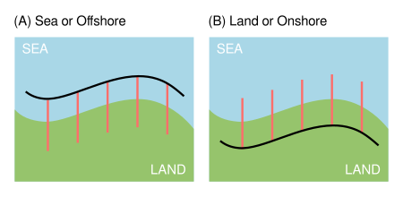

.. _tab_baseline:

*************
Tab: Baseline
*************

.. only:: html

   .. contents::
      :local:
      :depth: 2
      
Baseline Parameters
===================

The input layer is the **baseline** created in :ref:`generating baseline vectors <plugin_required_inputs_baseline>`:.

Baseline Placement
==================

After selecting the baseline layer, the next step is to choose the baseline placement. This selection determines whether the baseline is positioned seaward or offshore, or landward or onshore. The baseline placement defines the direction of the transects when casting. If the selected baseline placement is seaward or offshore (landward or onshore), the transects will be cast from the sea to the land (or land to the sea) as shown in :numref:`figure_baseline_placement`.

.. _figure_baseline_placement:

   
   Baseline placement

Baseline Orientation
====================
